# dsh-any-background

<a href="https://github.com/Tkingxiao/dsh-any-background" target="_blank">
  
</a>

English | [中文](README.zh.md)

A **DeepSeek Harness** appearance plugin that lets you fully customize the Web UI with a custom theme color, background wallpaper, and fine-grained opacity controls.

---

## Features

- **PS-style Color Wheel** — Pick hue on the ring, adjust saturation & lightness in the inscribed square. Generates a full set of 30+ CSS design tokens in real time and applies them instantly.
- **Background Wallpaper** — Choose any image as your wallpaper. Drag to pan, scroll to zoom inside a viewport-proportional editor. What you see is what you get.
- **Opacity Controls** — Separate sliders for main interface background opacity, settings panel opacity, and wallpaper opacity.
- **Blur Effect** — Adjustable wallpaper blur (0–60 px) for a frosted-glass look.
- **Persistent** — All settings (color, wallpaper, opacity, blur, editor position) are stored on the **filesystem** under `~/.dsh/.dsh-any-background-data/` via the node half, and restored on next launch. No more `localStorage` quota worries.
- **Bilingual** — Full Chinese / English UI with automatic locale detection.
- **Theme Watchdog** — A background watchdog re-asserts the custom theme if the host resets it, so your pick never silently disappears.

## Project Structure

```
dsh-any-background/
├── package.json          # Package metadata, dsh.client declaration, dependencies
├── cordis.patch.yml      # Bundle patch layer (inserted into profile composition)
├── cordis.yml            # Patch overlay for dev usage (pnpm dsh web --patch)
├── tsdown.config.ts      # Build config: node-half (ESM) + client-half (CJS browser bundle)
├── src/
│   ├── index.ts          # Node half — file-backed persistence (RPC file store)
│   ├── invariant.ts      # Invariant companion (registers package ownership)
│   └── client/
│       └── index.tsx     # Browser half — ALL UI logic lives here
├── lib/                  # Built output, committed so installs need no build step
│   ├── index.js          # Node entry
│   ├── invariant.js      # Invariant entry
│   ├── client.js         # Browser bundle (wrapped for __ModuleLoader__)
│   └── client.js.map     # Source map
├── example_img/          # Example screenshots
├── README.md             # This file (English)
└── README.zh.md          # 中文版
```

## Implementation

The plugin is a Cordis plugin split into two halves:

- **Node half** (`src/index.ts`) — owns file-backed persistence. It manages the `.dsh-any-background-data/` store under the DSH data home (`~/.dsh/`) and exposes a small RPC surface over the shared `/api` channel.
- **Browser half** (`src/client/index.tsx`) — all UI logic lives here. The browser cannot touch the filesystem, so it reads/writes the store through the node half's RPC endpoints.

### Persistence

Since the plugin surfaces in the browser, persisted data is stored on disk by the **node half**:

```
~/.dsh/.dsh-any-background-data/
├── theme-config.json   # color, main/settings/wallpaper opacity, blur, bg edit state
└── wallpaper.jpg       # the chosen background image (deleted when removed)
```

- On startup the client calls `read`, which returns the config and (if present) the wallpaper as a data URL.
- Every setting change is written back synchronously to `theme-config.json`; changing the wallpaper writes `wallpaper.jpg`, removing it deletes the file.
- The store is created automatically if missing; a missing or malformed config falls back to defaults (with a warning), and all writes are error-guarded to avoid data loss.

### Architecture

```
┌─────────────────────────────────────────────────────────┐
│  apply(ctx)  —  Plugin entry point                      │
├─────────────────────────────────────────────────────────┤
│                                                         │
│  1. Restore saved color → registerCustom() → setTheme   │
│  2. Inject gradient <style> into <head>                 │
│  3. Create state store (defineStore)                    │
│  4. applyWp() → wallpaper + token overrides             │
│  5. Listen theme/change → re-apply                      │
│  6. ResizeObserver → viewport-aware re-positioning      │
│  7. Locale registration (zh/en)                         │
│  8. Settings section injection (ThemeSection)           │
│  9. Deferred boot restore (300ms, 1500ms)               │
│ 10. Theme watchdog (1s interval)                        │
│                                                         │
└─────────────────────────────────────────────────────────┘
```

### Color Wheel

- Single `<canvas>` element: hue ring (360° segments) + inscribed SL square (HSV S-V plane).
- `hitTest()` determines whether a click lands on the ring (hue) or square (saturation/lightness).
- HSV values from the canvas are converted to HSL via `hsvToHsl()` before passing to `genTokens()`.
- `genTokens()` generates 30+ CSS custom properties (`--dsw-alias-*`) for the picked color, choosing dark or light scheme based on lightness.
- The full token set is written as inline styles on `<body>`, so the theme color never depends on the theme service's timing.

#### Theme Color Adjustment

<p align="center">
  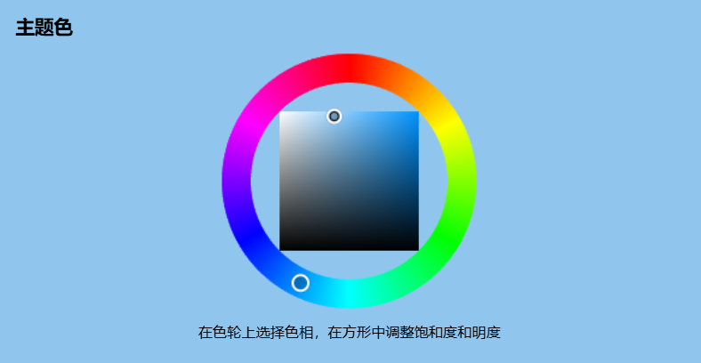
  <br/>
  <em>Blue theme · Light · Default dark font</em>
</p>

<p align="center">
  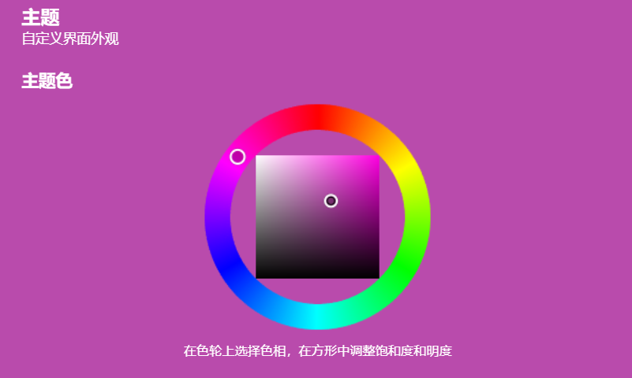
  <br/>
  <em>Pink theme · Dark · Default light font</em>
</p>

### Background Wallpaper

- A `<div>` with `position:fixed; z-index:-1` is prepended to `<body>`.
- Image is compressed via Canvas API (max 1600px side, JPEG quality 0.75); the node half writes it to `~/.dsh/.dsh-any-background-data/wallpaper.jpg`, and the client keeps the data URL in memory for display.
- The editor modal shows a viewport-proportional rectangle; drag to pan, scroll to zoom (0.1×–10×).
- Committed position is stored as fractional center coordinates + natural image size, so the layout survives viewport changes.
- Wallpaper opacity is applied directly to the `<div>` element; background color opacity is applied via inline token overrides.

#### Wallpaper Preview

<p align="center">
  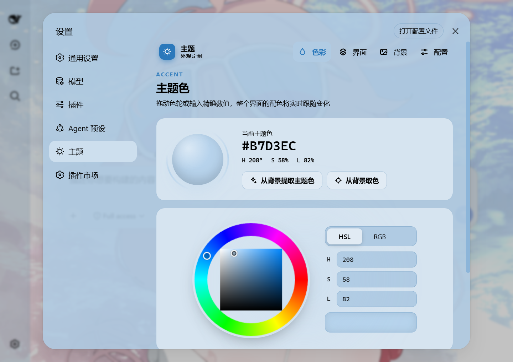
  <br/>
  <em>Wallpaper opacity and blur adjustment</em>
</p>

#### Editor Adjustment

<p align="center">
  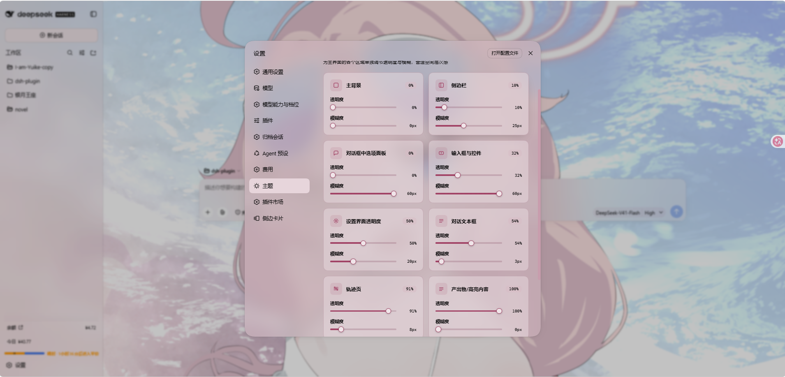
  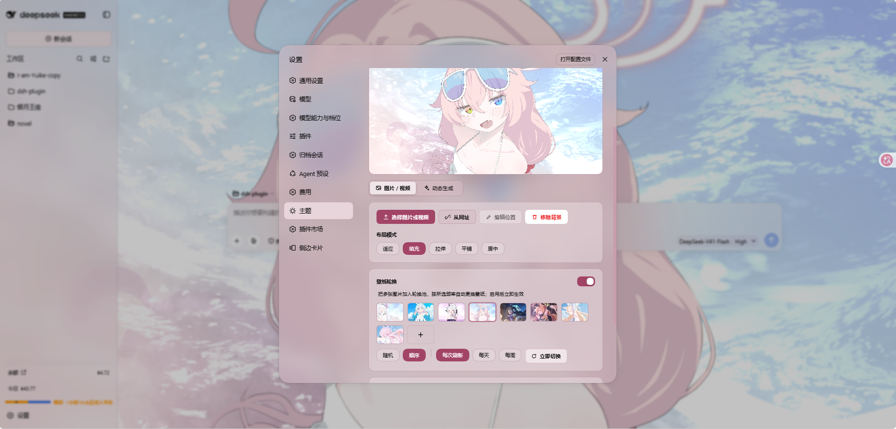
  <br/>
  <em>Editor adjustment · Background mapping</em>
</p>

### Opacity System

Three independent opacity layers, each with its own slider and a persisted config field:

| Layer | Config field | Default | Mechanism |
|-------|--------------|---------|-----------|
| Main interface | `opacity` | 85% | Inline CSS variable on `<body>` |
| Settings panel | `settingsOpacity` | 100% | CSS variable on `<html>` via `[aria-modal]` selector |
| Wallpaper | `wallpaperOpacity` | 100% | Direct `style.opacity` on wallpaper `<div>` |

#### Settings Opacity

<p align="center">
  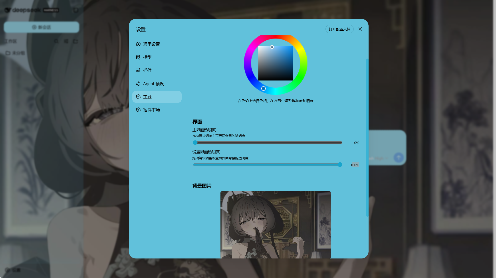
  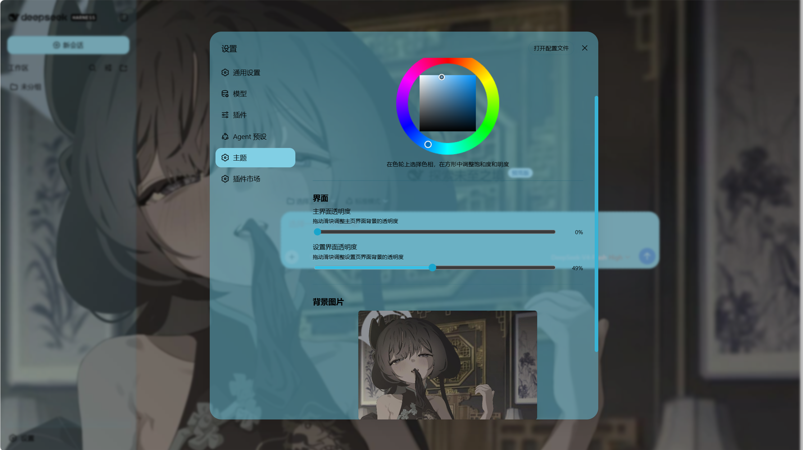
  <br/>
  <em>Settings opacity 100% · Settings opacity 49%</em>
</p>

#### Main Interface Opacity

<p align="center">
  
  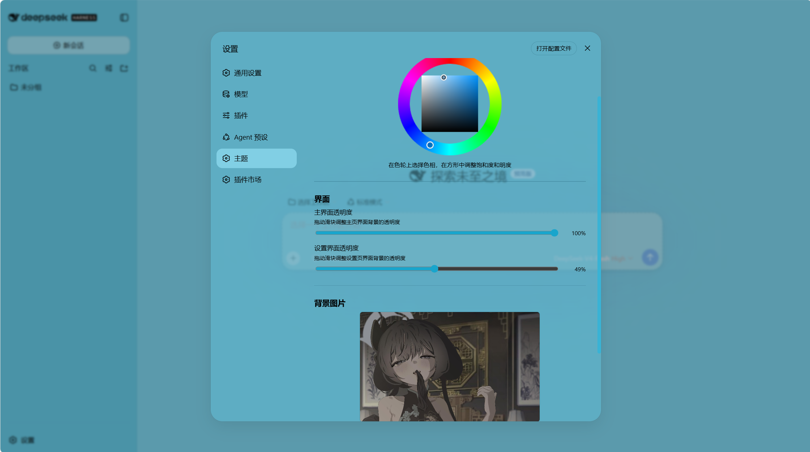
  <br/>
  <em>Main interface opacity 100% · Main interface opacity 0%</em>
</p>

#### Wallpaper Opacity

<p align="center">
  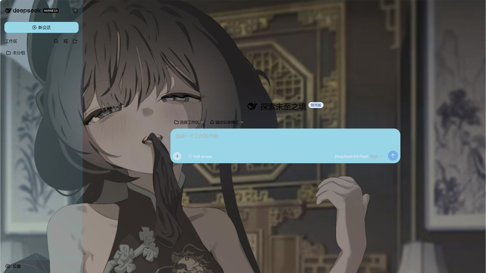
  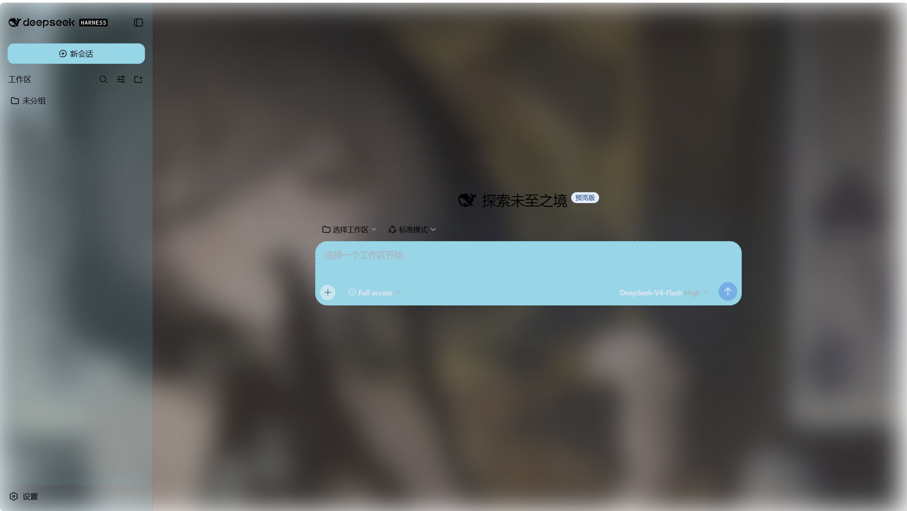
  <br/>
  <em>Wallpaper opacity 0% · Wallpaper opacity 100%</em>
</p>

#### Wallpaper Blur

<p align="center">
  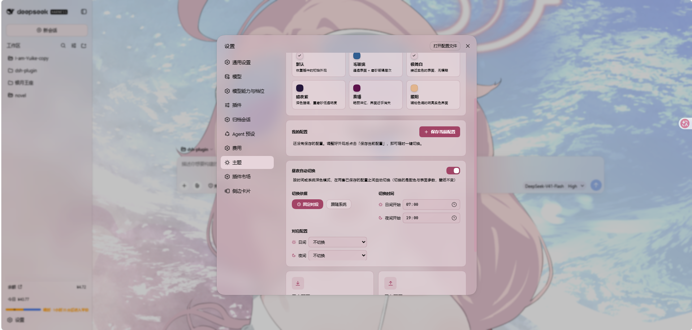
  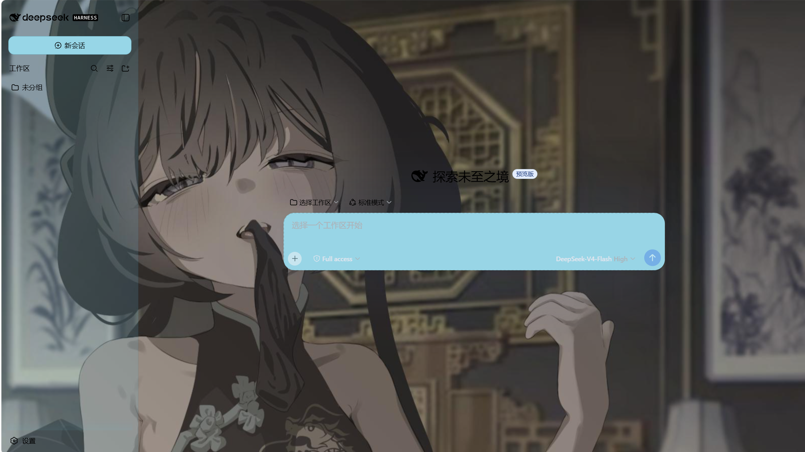
  <br/>
  <em>Wallpaper blur 50% · Wallpaper blur 0%</em>
</p>

## Installation

### Method 1: npm install (Recommended)

Install the plugin directly from GitHub into your Web profile:

```sh
dsh plugin --profile web add github:Tkingxiao/dsh-any-background
```
```sh
dsh plugin --profile web add dsh-any-background
```
Then launch the Web UI:

```sh
dsh web
```

The plugin will appear as a **"Theme"** section in the Settings panel.

### Method 2: npx (No Global Install)

If you don't have `dsh` installed globally, use `npx`:

```sh
npx @deepseek-ai/dsh plugin --profile web add github:Tkingxiao/dsh-any-background
```
```sh
npx @deepseek-ai/dsh plugin --profile web add dsh-any-background
```

Then launch:

```sh
npx @deepseek-ai/dsh web
```

### Method 3: Local Build (Development)

The `lib/` directory is committed, so installs need no build step. To rebuild after
editing `src/`, run the bundle script (needs Node + pnpm):

```sh
# 1. Clone this repo
git clone https://github.com/Tkingxiao/dsh-any-background.git
cd dsh-any-background

# 2. Install the build tool (also pulls the @deepseek-ai/dsh-home-paths runtime dep)
pnpm install

# 3. Rebuild lib/
pnpm run bundle

# 4. Install the plugin into the web profile from the local checkout
#    (`dsh plugin add` wraps `pnpm add <dir>`, so point it at this directory)
cd .
pnpm dsh plugin --profile web add “dsh-any-background”

# 5. Launch
pnpm dsh web
```

## Compatibility

The plugin works on both the **Web UI** and the **desktop client**:

- **[`dsh web`](https://github.com/deepseek-ai/deepseek-harness)** — Web profile, full support.
- **[deepseek-harness-desktop](https://github.com/anywhere-labs/deepseek-harness-desktop)** — supported, but there is a known Electron packaging issue: the **left sidebar and the center area opacity are inverted** (the sidebar looks more transparent than the center and vice versa). This is a client-side packaging bug, not a plugin bug — we are waiting for the desktop client to be updated to fix it.

## Dependencies

| Package | Purpose |
|---------|---------|
| `@deepseek-ai/cordis` | Plugin framework (Cordis) |
| `@deepseek-ai/dsh-home-paths` | Resolve the DSH data home for the persistence store |
| `@deepseek-ai/dsh-client-runtime` | Client runtime + `defineStore` |
| `@deepseek-ai/dsh-client-locale` | i18n (Chinese/English) |
| `@deepseek-ai/dsh-client-ui-theme` | Theme service (register/setTheme/overrideTokens) |
| `@deepseek-ai/dsh-invariants` | Package invariant companion |
| `react` ^18.2.0 | UI rendering |

## Star History

<a href="https://www.star-history.com/?repos=Tkingxiao%2Fdsh-any-background&type=timeline&legend=bottom-right">
 <picture>
   <source media="(prefers-color-scheme: dark)" srcset="https://api.star-history.com/chart?repos=Tkingxiao/dsh-any-background&type=timeline&theme=dark&legend=bottom-right&sealed_token=eWfGjN-Qq27TMTaT_VVvuRZMI72MUHAVfaHws-WOwQE7ld9defq7Bn7Xsgmlg-7iFSCeNoOIhgxFfZM3jazeXnLzldBkMCN3jm4CMxvn6Em0EBEZWWK5pA" />
   <source media="(prefers-color-scheme: light)" srcset="https://api.star-history.com/chart?repos=Tkingxiao/dsh-any-background&type=timeline&legend=bottom-right&sealed_token=eWfGjN-Qq27TMTaT_VVvuRZMI72MUHAVfaHws-WOwQE7ld9defq7Bn7Xsgmlg-7iFSCeNoOIhgxFfZM3jazeXnLzldBkMCN3jm4CMxvn6Em0EBEZWWK5pA" />
   
 </picture>
</a>

## License

MIT
